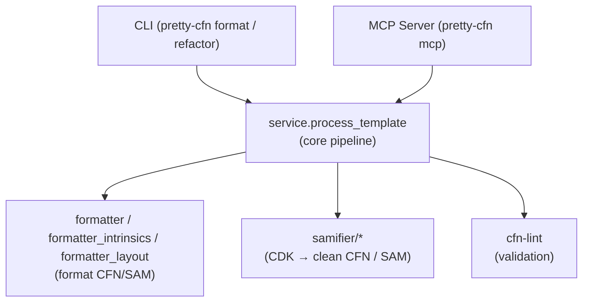

# Pretty CFN

Pretty CFN is a small, CDK-aware CloudFormation formatter. It formats CloudFormation/SAM templates, can
clean up CDK output, and can also pull and refactor deployed stacks. It ships as a simple CLI and a
FastMCP server so the same pipeline can power terminals and editors.

## Highlights

- **Formatter**: Aligns values, adds resource headers, and normalizes JSON/YAML while preserving intrinsics and literal blocks.
- **CDK Cleaner**: Recovers human-readable names from `cdk.out` metadata and removes bootstrap noise.
- **Stack Import**: Fetches deployed stacks (`--stack-name`) directly into your repo.
- **SAM Refactoring**: Converts CDK stacks to SAM projects (`--target sam-app`) with support for Lambda assets, API Gateway, Step Functions, AppSync, and common event sources.
- **Flexible I/O**: Works on stdin, files, directories, or live stacks.
- **MCP Support**: Exposes formatting and refactoring tools to editors and AI agents.


> [!WARN]
> SAM conversion (`refactor --target sam-app`) is **destructive** and intended for migrating legacy/unmaintained stacks. Do not run it against a live production stack without a full validation/deployment plan. 

## Installation

### Using uv (recommended)

```bash
uv tool install pretty-cfn --from git+https://github.com/alessandrobologna/pretty-cfn
```

or just run the tool directly with `uvx`:
```bash
uvx --from git+https://github.com/alessandrobologna/pretty-cfn pretty-cfn --help
```

### Development install

Clone the repo and then run:
```bash
uv venv && source ./.venv/bin/activate && uv pip install -e .
```

### Development extras

```bash
uv sync --extra dev
```

## Quick Start
To format a local template and print to stdout:

```bash
pretty-cfn format --input template.yaml
```


There are two main commands: `pretty-cfn format` (formatting) and `pretty-cfn refactor` (CDK cleaning and SAM conversion).


| Goal | Command |
| --- | --- |
| Format a file to stdout | `pretty-cfn format --input template.yaml`
| Write formatted output to another file | `pretty-cfn format --input template.yaml -o formatted.yaml`
| Overwrite in place | `pretty-cfn format --input template.yaml --overwrite`
| Using stdin/stdout | `pretty-cfn format < input.json > output.yaml`
| Clean a CDK template | `pretty-cfn refactor --input cdk.out/MyStack.template.json --target clean-cfn -o stacks/MyStack.yaml`
| One-liner refactoring conversion | `cdk synth \| pretty-cfn refactor --target sam-app --output ./`
| Scaffold a SAM app from a stack | `pretty-cfn refactor --stack-name prod-api --target sam-app --output sam/prod-api --overwrite`

## Common Workflows

### 1. Prettify a local template

```bash
pretty-cfn --input template.yaml --diff
pretty-cfn --input template.yaml --overwrite   # apply after review
```

What you get:

- Deterministic formatting (aligned values, consistent spacing, resource headers).
- cfn-lint is run automatically: errors always print and set a non-zero exit code, and warnings are printed when you pass `--lint`.
- Syntax highlighting by default when writing to a terminal (opt out with `--plain`).

### 2. Clean and rename CDK output

```bash
pretty-cfn refactor --input cdk.out/MyStack.template.json \
  --target clean-cfn \
  -o stacks/MyStack.yaml
```

What happens:

- `pretty-cfn` auto-detects nearby `cdk.out/`, `manifest.json`, or `tree.json` files to resolve logical IDs.
- Applies "semantic" renaming (human-readable names) by default.
- Removes CDK metadata and bootstrap rules.

### 3. Import a deployed stack into your repo

```bash
pretty-cfn format --stack-name prod-api -o stacks/prod-api.yaml
```

- Uses your AWS credentials/region to call `cloudformation get-template`.
- Runs the formatter + lint; CDK cleaning/SAM conversion are not applied here—use `refactor --target clean-cfn` or `refactor --target sam-app` if you need those.

### 4. Turn CDK Lambda assets into SAM

```bash
pretty-cfn refactor --input cdk.out/Service.template.json \
  --target sam-app \
  --output sam-app-dir \
  --overwrite
```

- Rewrites `AWS::Lambda::Function` resources (zip or inline) into `AWS::Serverless::Function` blocks.
- Converts Function URLs + API Gateway proxy resources into SAM events and updates references, and folds simple API Gateway RestApi shells (CDK CORS `OPTIONS` + Deployment/Stage) into a single `AWS::Serverless::Api` with `StageName` and `Cors`.
- Adds the SAM transform automatically and rewrites asset paths relative to the output file.

### 5. Scaffold a SAM app from a deployed stack

```bash
pretty-cfn refactor \
  --stack-name chat-app \
  --target sam-app \
  --output SamChatApp \
  --overwrite \
  --prefer-external        # optional: spill inline Lambda/AppSync assets to src/
```

- Produces `SamChatApp/template.yaml` plus staged sources under `SamChatApp/src` ready for `sam build`.
- Defaults to keeping inline assets inline; pass `--prefer-external` to write them to disk so editors work with real files.

## CLI Reference

### Input & Output

- `--input path` (YAML or JSON). Omit it to read from stdin.
- `--stack-name MyStack` formats a deployed stack instead of a local file.
- `-o/--output path` writes to a new file; `--overwrite` edits the input file in place.
- Piping is supported: `cat template.yaml | pretty-cfn -o formatted.yaml`.
- `--plain` disables syntax highlighting; otherwise colors are auto-enabled for TTY stdout.

### Review & Safety

- `--diff` prints a unified diff (pair with `--diff-exit-code` for CI gating).
- `--check` exits 1 if formatting would change the file.
- `--lint` prints cfn-lint warnings (errors always print either way and set a non-zero exit code).
- `--check/--diff/--overwrite` apply to formatting and clean/report refactors; `--target sam-app` always writes a SAM project into `--output` and bypasses these checks.

### Formatting Controls

- `--column N` (default 40) sets the alignment column.
- `--flow-style block|compact` controls YAML flow style (default: block).

### Refactoring (CDK Cleaning & SAM)

Use the `refactor` command for structural changes.

- `--target clean-cfn` (default): Performs CDK cleaning (semantic renaming, metadata removal). Auto-detects CDK metadata files in parent directories.
- `--target sam-app`: Performs CDK cleaning AND converts Lambda/API resources to SAM. Requires `--output` (must be a directory).
- `--target report-only`: Outputs a JSON report of the template traits and lint results.
- `--plan path.json`: Writes a JSON manifest describing the refactor operations.
- `--prefer-external`: (With `sam-app`) Spills inline assets to files.
- `--ignore-errors`: Allows writing output even when cfn-lint errors are present (for `--overwrite` and `--target sam-app`).

> **Note:** Fine-grained control over CDK options (like collision strategies or explicit rename maps) is currently available via the MCP interface but not the CLI flags.

## MCP Server

Run `pretty-cfn mcp` to expose the pipeline to MCP-compatible editors.

The server exposes deterministic tools for:
- **Formatting & Linting:** `format_template`, `format_local_template`, `format_deployed_stack`, `lint_template`.
- **Refactoring:** `refactor_local_app` and `refactor_deployed_stack`.

> [!NOTE]
> Most MCP tools are fully deterministic. The `find_stacks` tool may optionally use sampling via the host model to re-rank candidate CloudFormation stacks based on a free-text query. If sampling is unavailable or fails, it falls back to deterministic name-similarity scoring so results remain predictable.

Example Copilot MCP configuration:

```json
{
  "servers": {
    "pretty-cfn": {
      "type": "stdio",
      "command": "uvx",
      "args": [
        "--no-cache",
        "--from",
        "git+https://github.com/alessandrobologna/pretty-cfn",
        "pretty-cfn",
        "mcp"
      ]
    }
  }
}
```

## Development

The project is organised around a single processing pipeline with a few focused modules:

- `pretty_cfn.cli` and `pretty_cfn.main` handle argument parsing and dispatch.
- `pretty_cfn.service.process_template` is the central pipeline used by both the CLI and MCP server.
- `pretty_cfn.formatter*` implements the formatting logic; `pretty_cfn.samifier*` handles CDK cleaning and SAM conversion; `cfn-lint` provides validation.



```bash
make test         # run tests
make lint         # ruff checks
make format       # apply ruff formatting
make coverage     # run tests with coverage
```

PRs are welcome. If you hit formatting corner cases or want another MCP tool, open an issue with a small
sample template so it can be added as a regression test.
